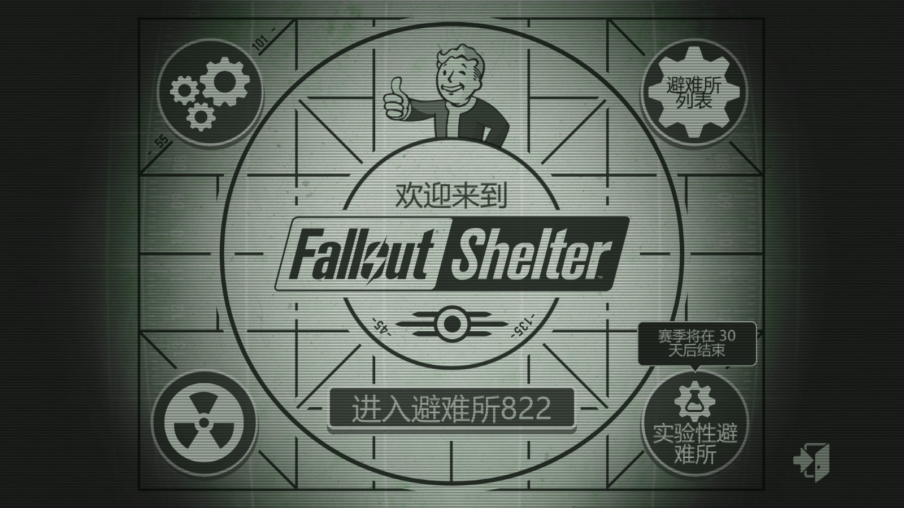
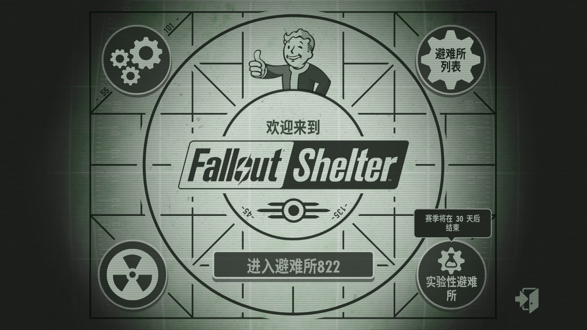

[简体中文](README.md) | **English**

# 🎮 Complete Chinese Localization Patch for Fallout Shelter (International Version)
 

> Complete text localization (only character names remain in English).

## 🖼️ Preview
| Without Patch | With Patch |
|----------|----------|
|  |  |

---

## ✨ Project Origin
Born from my perfectionism: Unable to accept literal translations and the rough appearance of the default font in the UI, I created this fully optimized localization patch covering both **translation quality and visual presentation**.

Inspired by a previous 1.13.13 localization tutorial ([link](https://steamcommunity.com/sharedfiles/filedetails/?id=2877972565)).

## 📅 Version Information
- **Current Version**: 2.1.1 Localization Patch
- **Compatible Game**: Fallout Shelter 2.x (Steam/GOG/Xbox PC)
- **Maintenance Status**: Current version is essentially complete; future updates as needed

---

## 🚀 Quick Start

### Installation Steps
1. **Install BepInEx**
   - Download [BepInEx 5.4.x](https://github.com/BepInEx/BepInEx/releases)
   - Extract to game root directory (same level as `FalloutShelter.exe`)

2. **Install Localization Plugin**
   - Download this project's `ChinesePatch.zip`
   - Extract and copy the `ChinesePatch` folder to `BepInEx/plugins/`

~~3. **(Optional, Recommended) Install Font Patch**~~  
   ~~- Download and run `Patch.exe`~~  
   ~~- Program will automatically backup and replace game font files~~  

4. **Launch Game**
   - Run `FalloutShelter.exe` directly
   - Wait for BepInEx initialization during startup

---

### File Structure
BepInEx/plugins/ChinesePatch/  
├── ChinesePatch.dll # Core plugin  
├── font_config.json # Font config (auto-generated)  
└── Translation/ # Translation texts  

---

## 🛠️ Development Toolchain

| Tool | Purpose | Link |
|------|---------|------|
| **UABEA** | Unity resource editing & export | [Download](https://github.com/nesrak1/UABEA/releases) |
| **Notepad++** | Batch text processing | [Official Site](https://notepad-plus-plus.org/) |
| **FontForge** | Font parameter modification | [Official Site](https://fontforge.org/en-US/) |

---

## 🔤 Font Replacement Solution

All fonts comply with **OFL (SIL Open Font License)** or similar open-source commercial licenses, perfectly supporting Chinese while maintaining the original style.

### Main Font Mapping Table
| Game Original Font | Replacement Font | License | Features |
|-------------------|------------------|---------|----------|
| **FuturaStd-CondensedBold** (Game titles) | [MonuTitl-0.96CnBd](https://github.com/MY1L/Monu) | OFL | Full character set support, ideal for titles |
| **FuturaStd-CondensedBoldObl** (Italic titles) | MonuTitl + **9° Italic** | OFL | Maintains original italic style |
| **monofonto** (Monospace text) | [SarasaMonoSC-Bold](https://github.com/be5invis/Sarasa-Gothic) | OFL | Monospace font, good for code display |
| **JennaSue** (Handwritten style) | [字制区喜脉欢喜体](https://www.maoken.com/freefonts/22002.html) | Free Commercial Use | Natural handwritten feel |
| **Boogaloo-Regular** (Rounded style) | [字制区喜脉体](https://www.maoken.com/freefonts/8918.html) | Free Commercial Use | Slender and rounded |
| **FontdinerSwanky** (Decorative style) | [铁蒺藜体](https://github.com/Buernia/Tiejili) | OFL | Highly decorative |
| **AIRSTREA** (Special titles) | [标小智龙珠体](https://github.com/fontworks-fonts/RocknRoll) + **12° Italic** + **78% Scale** | OFL | Special effects processing |

Among these, except for the two 字制区 fonts, others have been modified to adjust baseline alignment for better UI adaptation.

---

## 📂 Folder Description

`Translation/` folder contains:
- `LanguageSource_<version>_Original.txt` - Original English text
- `LanguageSource_<version>_Patch.txt` - Translation patch for UABEA
- `PetsCustomizationData_<version>_Patch.txt` - Pet name translations (for perfectionists)
- `translations.txt` - Complete latest translation text for plugin use

`ChinesePatch/` folder: Plugin source code

---

### Multi-language Adaptation
To adapt for **Traditional Chinese** or other languages:
1. Replace fonts with corresponding language versions
2. Modify translation texts

---

## ❓ Frequently Asked Questions

### Q: Will this affect game updates?
**A:** No. Translation uses BepInEx plugin method without modifying game files; font patches may need reinstallation after major updates.

### Q: Fonts appear inconsistent after applying font patch?
**A:** Open \Fallout Shelter\BepInEx\plugins\ChinesePatch\font_config.json with Notepad, change "Enabled" to false.

### Q: How to restore English?
**A:** Delete or rename the `ChinesePatch.dll` file. To restore original English fonts, delete data.unity3d in FalloutShelter_Data\ and rename data.unity3d.bak to data.unity3d.

### Q: Supports Steam/GOG/Xbox versions?
**A:** Theoretically supports all PC versions as long as BepInEx runs properly.

---

## 📄 License

Font files follow their respective open-source licenses (OFL, etc.).  
Code portion uses MIT License.

**Disclaimer**: This patch is for learning and exchange purposes only. Please support the official game.